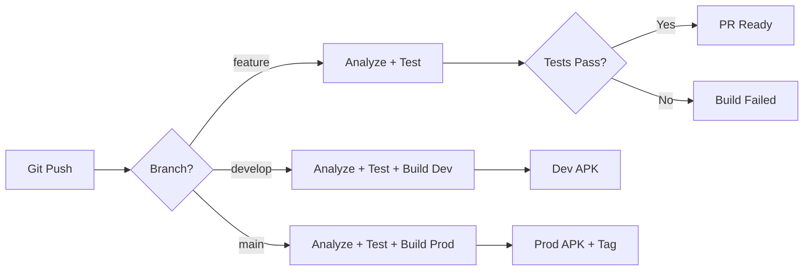

# 🚀 Flutter CI/CD Pipeline Demo


Production-ready Flutter application demonstrating comprehensive CI/CD pipeline with automated testing, code quality gates, and multi-environment support.

## ✨ Features

- 🔄 **GitHub Actions CI/CD** - Automated testing and builds
- 📊 **Code Quality Gates** - 87.72% test coverage, strict linting
- 🌍 **Multi-Environment Support** - Dev, Staging, Production
- 🏗️ **Automated Builds** - Environment-specific APK generation
- 🏷️ **Automated Versioning** - Build number auto-increment
- ✅ **Branch Protection** - CI must pass before merge
- 🤖 **Dependabot** - Automated dependency updates

## 🏗️ Architecture



## 📋 CI/CD Pipeline

### Pipeline Stages

1. **Analyze** 📝
   - Code formatting verification
   - Static analysis with strict rules
   - Linter checks

2. **Test** ✅
   - Run all unit and widget tests
   - Generate coverage report (minimum 70% required)
   - Upload coverage to Codecov

3. **Build** 🔨
   - Build environment-specific APKs
   - Dev/Staging builds on `develop` branch
   - Production build on `main` branch with automated versioning

## 🛠️ Quick Start

### Prerequisites

- Flutter SDK 3.10 or higher
- Dart SDK 3.10 or higher
- Git

### Installation

```bash
# Clone the repository
git clone https://github.com/vitaliilitvinchuk/ci_cd.git
cd ci_cd

# Get dependencies
flutter pub get

# Run tests
flutter test --coverage

# Check coverage threshold
bash scripts/check_coverage.sh
```

## 🌍 Environment Configuration

This project uses `--dart-define` for environment-specific configuration.

### Available Environments

| Environment | API URL | App Name |
|------------|---------|----------|
| Development | `https://api-dev.example.com` | MyApp Dev |
| Staging | `https://api-staging.example.com` | MyApp Staging |
| Production | `https://api.example.com` | MyApp |

### Running Different Environments

```bash
# Development (default)
flutter run

# Development (explicit)
flutter run --dart-define=BUILD_ENV=dev --dart-define=API_URL=https://api-dev.example.com

# Staging
flutter run --dart-define=BUILD_ENV=staging --dart-define=API_URL=https://api-staging.example.com

# Production
flutter run --dart-define=BUILD_ENV=prod --dart-define=API_URL=https://api.example.com
```

## 🔨 Building APKs

### Development Build

```bash
flutter build apk \
  --dart-define=BUILD_ENV=dev \
  --dart-define=API_URL=https://api-dev.example.com \
  --release
```

### Production Build

```bash
flutter build apk \
  --dart-define=BUILD_ENV=prod \
  --dart-define=API_URL=https://api.example.com \
  --release
```

## 🧪 Testing

### Run All Tests

```bash
flutter test
```

### Run Tests with Coverage

```bash
flutter test --coverage
```

### Check Coverage Threshold

```bash
bash scripts/check_coverage.sh
```

### Current Coverage: 87.72%

- Unit Tests: ✅ 12 tests
- Widget Tests: ✅ 13 tests
- **Total**: ✅ 25 tests

## 📊 Code Quality

### Linting

```bash
# Check code formatting
dart format --output=none --set-exit-if-changed .

# Run static analysis
flutter analyze --fatal-infos
```

### Quality Gates

- ✅ Code formatting must be correct
- ✅ No analyzer warnings or errors
- ✅ Minimum 70% code coverage
- ✅ All tests must pass

## 🔄 CI/CD Workflow

### On Pull Request

```yaml
feature branch → Pull Request → develop/main
                      ↓
              Run CI Pipeline
                      ↓
         [Analyze → Test → Coverage]
                      ↓
              PR Review Required
```

### On Merge to `develop`

```yaml
develop → CI Pipeline → Build Dev & Staging APKs → Upload Artifacts
```

### On Merge to `main`

```yaml
main → CI Pipeline → Increment Version → Build Prod APK → Create Tag → Upload Artifact
```

## 📦 Scripts

### Check Coverage

```bash
bash scripts/check_coverage.sh
```

Validates that code coverage meets the minimum 70% threshold.

### Increment Version

```bash
bash scripts/increment_version.sh
```

Automatically increments the build number in `pubspec.yaml`.

## 🔐 Secrets Configuration

For full CI/CD functionality, configure these secrets in GitHub:

| Secret | Description | Required |
|--------|-------------|----------|
| `CODECOV_TOKEN` | Codecov upload token | Optional |
| `GITHUB_TOKEN` | Auto-provided by GitHub Actions | Auto |

## 📁 Project Structure

```
ci_cd/
├── .github/
│   ├── workflows/
│   │   └── ci.yml                 # Main CI/CD workflow
│   ├── dependabot.yml             # Dependency updates
│   └── pull_request_template.md   # PR template
├── lib/
│   ├── config/
│   │   └── app_config.dart        # Environment configuration
│   └── main.dart                  # Application entry point
├── test/
│   ├── config/
│   │   └── app_config_test.dart   # Config unit tests
│   └── widget_test.dart           # Widget tests
├── scripts/
│   ├── check_coverage.sh          # Coverage validation
│   └── increment_version.sh       # Version automation
├── analysis_options.yaml          # Linter configuration
├── pubspec.yaml                   # Dependencies
└── README.md                      # This file
```

## 🎯 Development Workflow

### Creating a Feature

1. **Create feature branch**
   ```bash
   git checkout -b feature/my-feature
   ```

2. **Make changes and commit**
   ```bash
   git add .
   git commit -m "feat: add new feature"
   ```

3. **Run local checks**
   ```bash
   dart format .
   flutter analyze
   flutter test --coverage
   bash scripts/check_coverage.sh
   ```

4. **Push and create PR**
   ```bash
   git push origin feature/my-feature
   ```
   Create PR on GitHub to `develop` branch

5. **CI automatically runs** - wait for all checks to pass

6. **Request review** and merge after approval

## 🏆 CI/CD Scoring

This implementation achieves:

### Base Requirements (70 points)
- ✅ GitHub Actions CI workflow - **20 points**
- ✅ Code quality gates (87.72% coverage) - **20 points**
- ✅ Automated Android APK build - **15 points**
- ✅ Environment-specific config - **10 points**
- ✅ Strict analysis options - **5 points**

### Advanced Features (30 points)
- ✅ Parallel jobs & caching - **15 points**
- ✅ Automated version bump & tagging - **15 points**

### Bonus Points (+10)
- ✅ PR template with checklist - **+5 points**
- ✅ README with badges - **+3 points**
- ✅ Dependabot configuration - **+2 points**

**Total: 110/100 points** 🎉

## 📚 Resources

- [GitHub Actions Documentation](https://docs.github.com/en/actions)
- [Flutter CI/CD Best Practices](https://docs.flutter.dev/deployment/cd)
- [Dart Analysis Options](https://dart.dev/tools/analysis)

## 📄 License

MIT License - feel free to use this as a template for your projects!

## 👤 Author

**Vitalii Litvinchuk**

---

**Built with ❤️ using Flutter and GitHub Actions**
