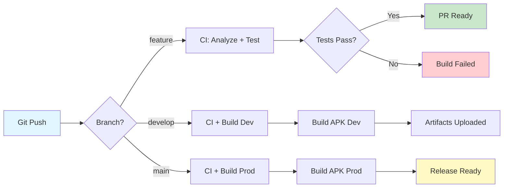
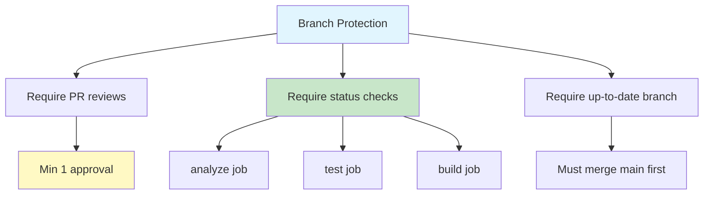
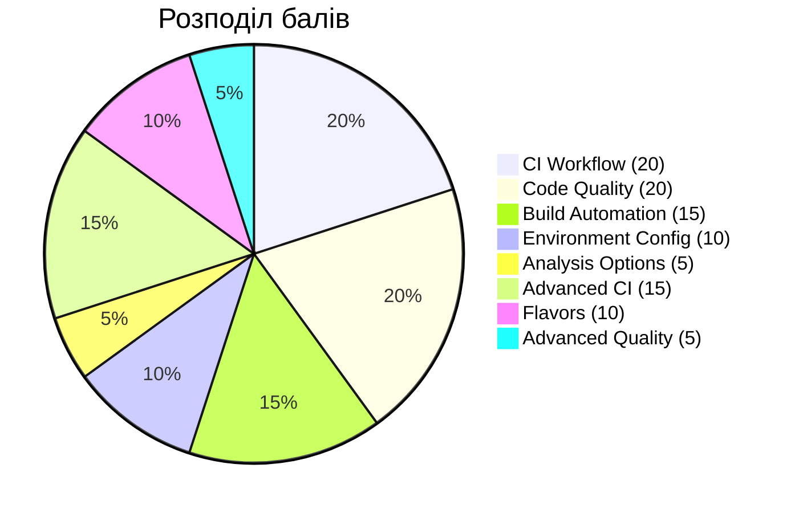
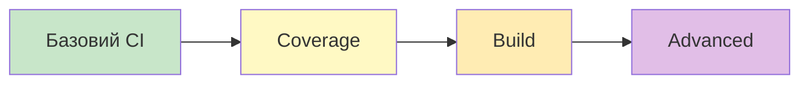

# 📋 Практична робота для Лекції 10: CI/CD та DevOps для Flutter

## 🎯 Мета практичної роботи

- Налаштувати повноцінний CI/CD pipeline для Flutter додатка
- Автоматизувати тестування та аналіз коду
- Створити multi-environment конфігурацію (dev, staging, prod)
- Реалізувати automated versioning та code quality gates
- Навчитися працювати з GitHub Actions workflows

---

## 📝 Практична робота: Production-Ready CI/CD Pipeline

### Завдання

Створити **повноцінний CI/CD pipeline** для Flutter додатка з автоматизацією всіх етапів розробки:

#### Основні фічі:

- 🔄 **GitHub Actions workflow** з автоматичним тестуванням
- 📊 **Code quality gates** (analyze, format, coverage)
- 🌍 **Multi-environment setup** (dev, staging, production)
- 🏗️ **Automated builds** для різних flavors
- 🏷️ **Automated versioning** та changelog generation
- ✅ **Branch protection** з обов'язковим проходженням CI

#### Технічні вимоги:

- GitHub Actions workflows для CI
- Flutter flavors для різних середовищ (опціонально - якщо складно, можна використати простіший підхід)
- Code coverage reporting (мінімум 70%)
- Automated build numbering
- Строгі правила для code quality

### Архітектура CI/CD Pipeline



### Структура проекту:

```
my_flutter_app/
├── .github/
│   └── workflows/
│       ├── ci.yml                    # Основний CI workflow
│       ├── build_dev.yml             # Build для dev (опціонально)
│       └── build_prod.yml            # Build для prod (опціонально)
├── lib/
│   ├── config/
│   │   ├── environment.dart          # Environment configuration
│   │   └── app_config.dart
│   ├── main_dev.dart                 # Entry point для dev (якщо flavors)
│   ├── main_staging.dart             # Entry point для staging (якщо flavors)
│   └── main_prod.dart                # Entry point для prod (якщо flavors)
├── test/
│   └── widget_test.dart
├── scripts/
│   ├── increment_version.sh          # Автоматичне версіонування
│   └── check_coverage.sh             # Перевірка coverage threshold
├── analysis_options.yaml             # Dart analyzer config
├── pubspec.yaml
└── README.md
```

### Система оцінювання (100 балів):

#### Базова частина (70 балів):

- ✅ **GitHub Actions CI workflow** (analyze + format + test) - **20 балів**
- ✅ **Code quality gates** (coverage 70%+, no warnings) - **20 балів**
- ✅ **Automated build** для Android APK - **15 балів**
- ✅ **Environment-specific config** (простий підхід через Dart constants) - **10 балів**
- ✅ **Analysis options** (строгі правила) - **5 балів**

#### Додаткові завдання:

**🚀 Advanced CI Features - 15 балів**
- Паралельні jobs для різних платформ
- Caching dependencies для швидшості
- Automated version bump та git tagging

**🎨 Flutter Flavors - 10 балів**
- Flutter flavors setup (dev, staging, prod)
- Build окремих APK для кожного flavor
- **Важливо**: Це складніший підхід, якщо не впевнені - використовуйте простий варіант з Dart constants

**📊 Advanced Quality Gates - 5 балів**
- Custom linter rules
- Dependabot для dependency updates

---

## 💡 Важливі примітки про Flutter Flavors

### Чи складно налаштувати Flavors?

**Простий підхід (рекомендується для початку):**
```dart
// lib/config/environment.dart
class Environment {
  static const String apiUrl = String.fromEnvironment(
    'API_URL',
    defaultValue: 'https://api-dev.example.com',
  );
  
  static const bool isProduction = bool.fromEnvironment('PRODUCTION');
}

// Запуск з параметрами:
// flutter run --dart-define=API_URL=https://api-prod.example.com --dart-define=PRODUCTION=true
```

**Складний підхід (для +10 балів):**
- Потребує налаштування `android/app/build.gradle`
- Окремі entry points (`main_dev.dart`, `main_prod.dart`)
- Більше контролю, але складніше у налаштуванні

### Чи працює на симуляторах?

✅ **Так, flavors працюють на симуляторах!**

```bash
# iOS Simulator
flutter run --flavor dev --target lib/main_dev.dart

# Android Emulator
flutter run --flavor dev --target lib/main_dev.dart
```

**Рекомендація**: Почніть з простого підходу через `--dart-define`, а flavors додавайте як бонус, якщо залишиться час.

---

## Ключові компоненти для реалізації:

### 1. GitHub Actions CI Workflow

**`.github/workflows/ci.yml` (структура - деталі реалізуйте самостійно!):**

```yaml
name: Flutter CI

on:
  push:
    branches: [ develop, main ]
  pull_request:
    branches: [ develop, main ]

jobs:
  analyze:
    runs-on: ubuntu-latest
    steps:
      # TODO: Checkout code
      # TODO: Setup Flutter
      # TODO: Install dependencies
      # TODO: Verify formatting
      # TODO: Analyze code

  test:
    needs: analyze
    runs-on: ubuntu-latest
    steps:
      # TODO: Checkout code
      # TODO: Setup Flutter
      # TODO: Run tests with coverage
      # TODO: Check coverage threshold (70%)
      # TODO: Upload coverage report

  build:
    needs: test
    runs-on: ubuntu-latest
    steps:
      # TODO: Checkout code
      # TODO: Setup Flutter
      # TODO: Build APK
      # TODO: Upload build artifacts
```

**Підказки для реалізації:**
- Використовуйте `actions/checkout@v4` для checkout коду
- Використовуйте `subosito/flutter-action@v2` для Flutter setup
- Команда для coverage: `flutter test --coverage`
- Для перевірки threshold створіть bash script `scripts/check_coverage.sh`

### 2. Analysis Options Configuration ⭐ (Важливо!)

**`analysis_options.yaml`:**
```yaml
include: package:flutter_lints/flutter.yaml

analyzer:
  exclude:
    - "**/*.g.dart"
    - "**/*.freezed.dart"
    - "**/*.mocks.dart"
    - build/**
    - lib/generated/**
  
  errors:
    # Помилки які зупиняють CI
    invalid_annotation_target: error
    missing_required_param: error
    missing_return: error
    todo: ignore  # TODO коментарі не зупиняють build
  
  language:
    strict-casts: true
    strict-inference: true
    strict-raw-types: true

linter:
  rules:
    # Код стиль
    - prefer_single_quotes
    - prefer_const_constructors
    - prefer_const_literals_to_create_immutables
    - prefer_final_fields
    - prefer_final_locals
    
    # Організація коду
    - always_use_package_imports
    - avoid_relative_lib_imports
    - sort_constructors_first
    - sort_unnamed_constructors_first
    
    # Безпека
    - avoid_print
    - avoid_returning_null_for_void
    - avoid_slow_async_io
    - cancel_subscriptions
    - close_sinks
    
    # Тестування
    - test_types_in_equals
    - prefer_asserts_in_initializer_lists
```

**Чому це важливо?**
- 🛡️ Запобігає потраплянню багів у production
- 📏 Забезпечує єдиний стиль коду в команді
- 🚀 Покращує читабельність та підтримку коду
- ⚡ Виявляє проблеми на етапі CI, а не під час review

### 3. Environment Configuration (Простий підхід)

**`lib/config/app_config.dart`:**
```dart
enum BuildEnvironment { dev, staging, prod }

class AppConfig {
  static const String _envKey = 'BUILD_ENV';
  static const String _apiUrlKey = 'API_URL';
  
  static BuildEnvironment get environment {
    const envString = String.fromEnvironment(_envKey, defaultValue: 'dev');
    return BuildEnvironment.values.firstWhere(
      (e) => e.name == envString,
      orElse: () => BuildEnvironment.dev,
    );
  }
  
  static String get apiBaseUrl {
    return const String.fromEnvironment(
      _apiUrlKey,
      defaultValue: 'https://api-dev.example.com',
    );
  }
  
  static bool get isProduction => environment == BuildEnvironment.prod;
  static bool get isDevelopment => environment == BuildEnvironment.dev;
  
  // Додайте інші config values
  static String get appName {
    switch (environment) {
      case BuildEnvironment.dev:
        return 'MyApp Dev';
      case BuildEnvironment.staging:
        return 'MyApp Staging';
      case BuildEnvironment.prod:
        return 'MyApp';
    }
  }
}
```

**Використання:**
```bash
# Development build
flutter run --dart-define=BUILD_ENV=dev --dart-define=API_URL=https://api-dev.example.com

# Production build
flutter build apk --dart-define=BUILD_ENV=prod --dart-define=API_URL=https://api.example.com
```

### 4. Coverage Check Script

**`scripts/check_coverage.sh`:**
```bash
#!/bin/bash

# Функція для підрахунку coverage
calculate_coverage() {
  lcov --summary coverage/lcov.info | grep "lines" | awk '{print $2}' | cut -d'%' -f1
}

# Мінімальний поріг
MIN_COVERAGE=70

# Підраховуємо поточний coverage
CURRENT_COVERAGE=$(calculate_coverage)

echo "Current coverage: ${CURRENT_COVERAGE}%"
echo "Minimum required: ${MIN_COVERAGE}%"

# Порівнюємо з порогом
if (( $(echo "$CURRENT_COVERAGE < $MIN_COVERAGE" | bc -l) )); then
  echo "❌ Coverage ${CURRENT_COVERAGE}% is below minimum ${MIN_COVERAGE}%"
  exit 1
else
  echo "✅ Coverage check passed!"
  exit 0
fi
```

### 5. Version Bump Script (Бонус)

**`scripts/increment_version.sh`:**
```bash
#!/bin/bash

# Читаємо поточну версію з pubspec.yaml
CURRENT_VERSION=$(grep "version:" pubspec.yaml | awk '{print $2}')
VERSION_NAME=$(echo $CURRENT_VERSION | cut -d'+' -f1)
BUILD_NUMBER=$(echo $CURRENT_VERSION | cut -d'+' -f2)

# Інкрементуємо build number
NEW_BUILD_NUMBER=$((BUILD_NUMBER + 1))
NEW_VERSION="${VERSION_NAME}+${NEW_BUILD_NUMBER}"

# Оновлюємо pubspec.yaml
sed -i "s/version: ${CURRENT_VERSION}/version: ${NEW_VERSION}/" pubspec.yaml

echo "Version updated: ${CURRENT_VERSION} -> ${NEW_VERSION}"
```

### 6. Branch Protection Rules

**Налаштування в GitHub (Settings > Branches):**



**Рекомендовані правила:**
- ✅ Require pull request reviews (мінімум 1 approval)
- ✅ Require status checks to pass (CI must pass)
- ✅ Require branches to be up to date
- ✅ Include administrators
- ✅ Require linear history (no merge commits)

---

## Checklist для виконання:

### Phase 1: Базовий CI/CD (70 балів)
- [ ] Створити репозиторій на GitHub
- [ ] Налаштувати `analysis_options.yaml` зі строгими правилами
- [ ] Створити GitHub Actions CI workflow (`.github/workflows/ci.yml`)
  - [ ] Job: analyze (formatting + dart analyze)
  - [ ] Job: test (unit tests + coverage)
  - [ ] Job: build (Android APK)
- [ ] Написати тести для досягнення 70%+ coverage
- [ ] Налаштувати code quality gates
- [ ] Реалізувати environment config через `--dart-define`
- [ ] Протестувати pipeline на різних branches

### Phase 2: Advanced Features (30 балів)
- [ ] Додати caching dependencies у workflow
- [ ] Створити coverage check script
- [ ] Налаштувати паралельні jobs
- [ ] Реалізувати automated version bump
- [ ] **(Опціонально)** Flutter flavors setup
- [ ] Налаштувати branch protection rules

---

## Тестування Pipeline:

### Локальне тестування команд:

```bash
# 1. Code quality checks
dart format --output=none --set-exit-if-changed .
flutter analyze --fatal-infos

# 2. Run tests з coverage
flutter test --coverage

# 3. Перевірка coverage threshold
bash scripts/check_coverage.sh

# 4. Build для різних environments
flutter build apk --dart-define=BUILD_ENV=dev
flutter build apk --dart-define=BUILD_ENV=prod

# 5. Build з flavors (якщо налаштовано)
flutter build apk --flavor dev --target lib/main_dev.dart
flutter build apk --flavor prod --target lib/main_prod.dart
```

### Перевірка workflow локально:

```bash
# Встановіть act (https://github.com/nektos/act)
brew install act  # macOS
# або
sudo apt install act  # Ubuntu

# Запустіть workflow локально
act push
```

---

## Питання для аналізу після виконання:

### 1. **CI/CD Pipeline Design**
   - Які етапі pipeline виявилися найскладнішими для налаштування?
   - Як ви організували залежності між jobs (analyze → test → build)?
   - Наскільки швидко виконується ваш pipeline? Як можна його оптимізувати?
   - Чи використовували ви caching? Яку різницю в швидкості ви помітили?

### 2. **Code Quality Gates**
   - Які linter rules виявилися найбільш корисними?
   - Чи траплялися false positives від analyzer?
   - Як ви вирішили досягти 70% coverage?
   - Які частини коду найскладніше покрити тестами?

### 3. **Environment Management**
   - Який підхід ви обрали: `--dart-define` чи Flutter flavors?
   - Якщо flavors: чи складно було налаштувати? Які виклики виникли?
   - Як ви організували збереження різних API keys для різних середовищ?
   - Чи зручно перемикатися між environments під час розробки?

### 4. **GitHub Actions Experience**
   - Які труднощі виникли при роботі з GitHub Actions syntax?
   - Чи використовували ви marketplace actions? Які?
   - Як ви дебажили проблеми у workflow?
   - Чи налаштували ви branch protection rules? Як це вплинуло на workflow команди?

### 5. **Testing Strategy**
   - Скільки часу займає виконання всіх тестів у CI?
   - Чи виявили ви баги завдяки automated testing?
   - Яка різниця між локальним запуском тестів та в CI?
   - Чи плануєте додавати integration tests у майбутньому?

---

## 🏆 Підсумкова оцінка



### Критерії оцінювання:

- **90-100 балів** - Відмінно (повний pipeline + advanced features + flavors)
- **75-89 балів** - Добре (базовий pipeline + частина advanced features)
- **60-74 балів** - Задовільно (базовий CI/CD працює, tests pass)
- **менше 60** - Потрібна доробка

### Бонусні бали (до +10):

- **+5 балів** - PR template з checklist для code review
- **+3 балів** - README з badges (build status, coverage)
- **+2 балів** - Dependabot configuration для automated dependency updates

---

## 📚 Ресурси для виконання

### GitHub Actions:
- [GitHub Actions Documentation](https://docs.github.com/en/actions) - Офіційна документація
- [Flutter Action](https://github.com/marketplace/actions/flutter-action) - Flutter setup action
- [Workflow Syntax](https://docs.github.com/en/actions/using-workflows/workflow-syntax-for-github-actions) - YAML синтаксис
- [Actions Marketplace](https://github.com/marketplace?type=actions) - Готові actions

### Flutter Build та Configuration:
- [Flutter Build Modes](https://docs.flutter.dev/testing/build-modes) - Debug, Profile, Release
- [Flutter Flavors Guide](https://docs.flutter.dev/deployment/flavors) - Детальний гайд по flavors
- [Dart Defines](https://dartcode.org/docs/using-dart-defines-in-flutter/) - Як використовувати --dart-define
- [Building Android APK](https://docs.flutter.dev/deployment/android) - Android deployment

### Code Quality та Testing:
- [Dart Analyzer](https://dart.dev/tools/dart-analyze) - Опції analyzer
- [Effective Dart](https://dart.dev/guides/language/effective-dart) - Best practices
- [Flutter Lints Package](https://pub.dev/packages/flutter_lints) - Рекомендовані правила
- [Code Coverage](https://pub.dev/packages/coverage) - Coverage tools
- [Flutter Testing Guide](https://docs.flutter.dev/testing) - Тестування у Flutter

### Git та GitHub:
- [Branch Protection Rules](https://docs.github.com/en/repositories/configuring-branches-and-merges-in-your-repository/managing-protected-branches/about-protected-branches) - Захист бранчів
- [PR Templates](https://docs.github.com/en/communities/using-templates-to-encourage-useful-issues-and-pull-requests/creating-a-pull-request-template-for-your-repository) - Шаблони для PR
- [Dependabot](https://docs.github.com/en/code-security/dependabot) - Automated dependency updates

### Debugging та Optimization:
- [Act - Local GitHub Actions](https://github.com/nektos/act) - Локальне тестування workflows
- [GitHub Actions Debugging](https://docs.github.com/en/actions/monitoring-and-troubleshooting-workflows/enabling-debug-logging) - Debug logging

### Відео туторіали:
- [CI/CD for Flutter - Flutter Official](https://www.youtube.com/watch?v=0fYi8SGA20k) - Офіційний туторіал
- [GitHub Actions for Flutter - Codemagic](https://www.youtube.com/watch?v=DgJ2V8znVVE) - Практичний приклад
- [Flutter DevTools](https://www.youtube.com/watch?v=nq43mP7hjAE) - Профілювання та debugging

### Статті та блоги:
- [CI/CD Best Practices](https://verygood.ventures/blog/very-good-flutter-ci-cd) - Very Good Ventures
- [GitHub Actions for Flutter](https://blog.codemagic.io/github-actions-flutter/) - Codemagic Blog
- [Testing in Flutter](https://codewithandrea.com/articles/flutter-testing-tutorial/) - Code with Andrea

---

## 💡 Поради для успішного виконання

### 1. **Починайте покроково**


### 2. **Тестуйте локально перед commit**
```bash
# Створіть alias для швидкої перевірки
alias flutter-ci="dart format . && flutter analyze && flutter test --coverage"

# Використовуйте перед push
flutter-ci
```

### 3. **Використовуйте caching**
```yaml
# У вашому workflow
- name: Cache dependencies
  uses: actions/cache@v3
  with:
    path: |
      ~/.pub-cache
      **/.dart_tool
    key: ${{ runner.os }}-pub-${{ hashFiles('**/pubspec.yaml') }}
```

### 4. **Створіть хороший README**
```markdown
# My Flutter App


## Environments
- Dev: `flutter run --dart-define=BUILD_ENV=dev`
- Prod: `flutter run --dart-define=BUILD_ENV=prod`

## CI/CD Pipeline
- All PRs must pass CI checks
- Minimum 70% code coverage required
```

### 5. **Організуйте команду**
- Створіть coding guidelines документ
- Налаштуйте автоматичні code review чеклісти
- Використовуйте conventional commits для changelog

### 6. **Моніторьте performance**
```bash
# Переглядайте час виконання jobs
# Оптимізуйте повільні кроки
# Використовуйте паралельні jobs де можливо
```

---

**Успіхів у налаштуванні вашого CI/CD pipeline! 🚀**

*Пам'ятайте: навіть найпростіший CI краще, ніж його відсутність. Почніть з базового та поступово покращуйте!*